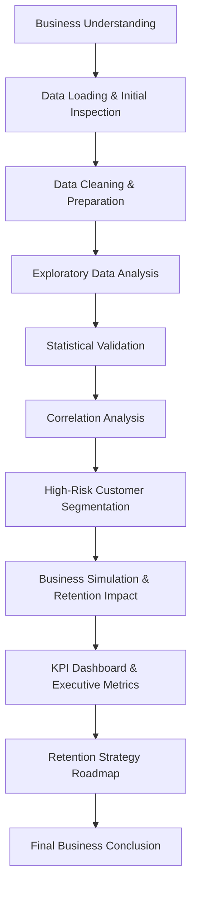
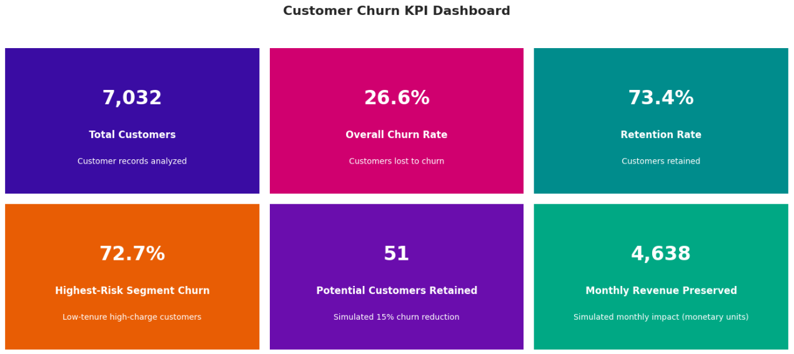
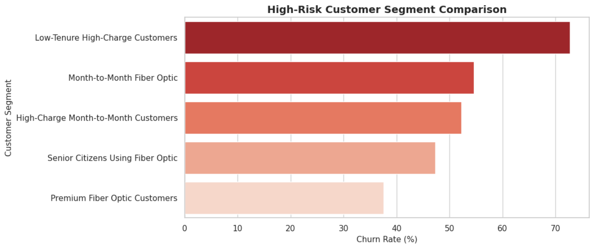
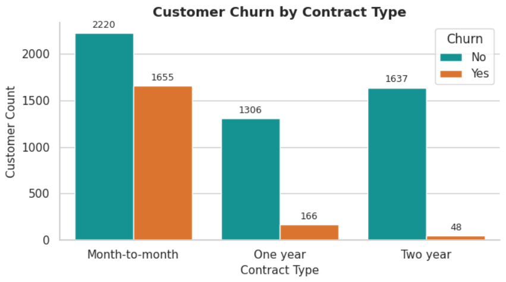

# Telecom Customer Churn Analysis & Retention Strategy

## Business Analytics Case Study: Statistical Validation, Customer Segmentation, KPI Dashboarding, and Retention Impact Simulation


## Project Summary

Customer churn is a major business challenge for telecom companies because it directly impacts recurring revenue, customer lifetime value, and customer acquisition costs.

This project analyzes telecom customer churn behavior to identify key churn drivers, validate important patterns statistically, segment high-risk customers, estimate potential retention impact, and translate analytical findings into actionable business strategies.

The project is structured as an end-to-end business analytics case study covering exploratory analysis, statistical validation, customer segmentation, KPI dashboarding, business simulation, and retention strategy development.

---

## Business Problem

Telecom companies operate in a highly competitive environment where retaining existing customers is often more cost-effective than acquiring new customers.

The key business problem addressed in this project is:

**Which customer groups are most likely to churn, what factors are associated with churn behavior, and how can the business prioritize retention strategies to reduce customer attrition?**

---

## Project Objectives

The objective of this project is to:

- Identify major customer churn drivers.
- Analyze churn patterns across customer demographics, services, contracts, payments, tenure, and charges.
- Validate key churn relationships using statistical testing.
- Build high-risk customer segments based on multiple churn indicators.
- Estimate potential retention and revenue impact using business simulation.
- Summarize key business metrics through an executive KPI dashboard.
- Recommend prioritized retention strategies for business decision-making.

---

## Dataset Overview

The dataset contains telecom customer information including demographics, service usage, account details, billing information, and churn status.

| Category | Description |
|---|---|
| Customer Records | 7,032 customers analyzed |
| Target Variable | Churn |
| Customer Demographics | Senior citizen status, partner, dependents |
| Service Information | Phone service, internet service, online security, streaming services |
| Account Information | Contract type, tenure, payment method, paperless billing |
| Billing Variables | Monthly charges and total charges |

---

## Tools & Technologies

| Area | Tools Used |
|---|---|
| Programming | Python |
| Data Analysis | Pandas |
| Data Visualization | Matplotlib, Seaborn |
| Statistical Testing | SciPy |
| Notebook Environment | Google Colab |
| Version Control | GitHub |
| BI Dashboard | Power BI dashboard in progress |

---

## Analytical Workflow



---

## Visual Project Highlights

The following visuals summarize the most important business findings from the notebook, including churn KPIs, high-risk segment comparison, and contract-based churn behavior.

### Executive KPI Dashboard

The KPI dashboard provides a compact executive view of churn performance, customer retention, high-risk segment exposure, and simulated revenue preservation.



---

### High-Risk Customer Segment Comparison

This visual compares churn exposure across the identified high-risk customer segments and highlights where retention efforts should be prioritized first.



---

### Churn by Contract Type

Contract type emerged as a major churn-associated factor, with month-to-month customers showing substantially higher churn compared to one-year and two-year contract customers.



---

## Key Business Insights

- The overall customer churn rate is approximately **26.6%**, meaning nearly one-fourth of the customer base is affected by churn.
- Customers on **month-to-month contracts** show substantially higher churn compared to customers on one-year and two-year contracts.
- **Low-tenure customers with high monthly charges** represent the most critical churn-risk segment, with churn reaching approximately **72.7%**.
- **Fiber optic customers** show elevated churn vulnerability, especially when combined with flexible contracts or high monthly charges.
- Customers using **electronic check payments** show higher churn compared to customers using automatic payment methods.
- Statistical testing confirmed that contract type, payment method, internet service category, tenure, monthly charges, and senior citizen status have meaningful relationships with churn behavior.

---

## Statistical Validation

Statistical tests were applied to validate whether the observed churn patterns were meaningful and unlikely to be driven by random variation alone.

| Test Used | Purpose |
|---|---|
| Chi-Square Test | Tested relationships between categorical variables and churn |
| Welch’s t-test | Compared numerical variables between churned and retained customers |

The statistical validation supported the reliability of the major churn patterns identified during the analysis.

---

## High-Risk Customer Segments

High-risk customer segments were created by combining the strongest churn indicators identified during the analysis.

| Rank | Customer Segment | Churn Rate |
|---:|---|---:|
| 1 | Low-Tenure High-Charge Customers | 72.7% |
| 2 | Month-to-Month Fiber Optic Customers | 54.6% |
| 3 | High-Charge Month-to-Month Customers | 52.2% |
| 4 | Senior Citizens Using Fiber Optic | 47.3% |
| 5 | Premium Fiber Optic Customers | 37.6% |

The highest-risk segment was selected for deeper retention impact simulation because it showed the strongest churn exposure.

---

## Retention Impact Simulation

A hypothetical retention intervention was simulated for the highest-risk customer segment.

| Metric | Value |
|---|---:|
| Highest-Risk Segment | Low-Tenure High-Charge Customers |
| Segment Size | 472 customers |
| Estimated Churn Customers | 343 customers |
| Simulated Churn Reduction | 15% |
| Potential Customers Retained | 51 customers |
| Estimated Monthly Revenue Preserved | 4,638 monetary units |

Revenue values are reported as **monetary units** because the dataset does not explicitly confirm the currency.

---

## KPI Dashboard Summary

The KPI dashboard provides an executive-level view of customer base overview, churn performance, high-risk segment exposure, and simulated retention impact.

| KPI | Value |
|---|---:|
| Total Customers | 7,032 |
| Overall Churn Rate | 26.6% |
| Retention Rate | 73.4% |
| Highest-Risk Segment Churn | 72.7% |
| Potential Customers Retained | 51 |
| Monthly Revenue Preserved | 4,638 monetary units |

---

## Retention Strategy Roadmap

The roadmap converts the churn analysis into prioritized business actions. Recommendations are ordered by churn severity, high-risk segment concentration, and retention impact potential.

| Priority | Strategic Focus | Target Segment | Recommended Action |
|---|---|---|---|
| P1 | Stabilize Early-Stage High-Charge Customers | Low-tenure high-charge customers | Strengthen onboarding, proactive check-ins, and early retention offers |
| P2 | Convert Flexible Contracts into Long-Term Plans | Month-to-month customers | Offer upgrade incentives, loyalty benefits, and bundled long-term plans |
| P3 | Optimize Pricing for High-Charge Customers | High monthly charge customers | Introduce targeted discounts, value bundles, and personalized pricing support |
| P4 | Improve Fiber Optic Customer Experience | Fiber optic and premium-service customers | Strengthen technical support, service monitoring, and premium retention packages |
| P5 | Build Segment-Based Retention Campaigns | Customers with multiple churn-risk signals | Create targeted campaigns and track retention outcomes by segment |
| P6 | Promote Automatic Payment Adoption | Electronic check payment users | Simplify auto-pay enrollment and encourage automatic payment methods |
| P7 | Strengthen Senior Customer Support | Senior customers using premium services | Provide clearer communication, proactive support, and simplified billing assistance |

---

## Repository Structure

```text
telecom-customer-churn-analysis/
│
├── dashboard/
│   └── Power BI dashboard files will be added here
│
├── data/
│   └── Telco-Customer-Churn.csv
│
├── notebooks/
│   └── telecom_customer_churn_analysis.ipynb
│
├── reports/
│   └── exported reports and summaries will be added here
│
├── visuals/
│   ├── kpi_dashboard.png
│   ├── high_risk_segment_comparison.png
│   └── churn_by_contract_type.png
│
├── README.md
└── requirements.txt
```

---

## How to Run This Project

1. Clone the repository:

```bash
git clone <repository-url>
```

2. Install required libraries:

```bash
pip install -r requirements.txt
```

3. Open the notebook:

```text
notebooks/telecom_customer_churn_analysis.ipynb
```

4. Run the notebook cells from top to bottom.

---

## Requirements

The project uses the following Python libraries:

```text
pandas
matplotlib
seaborn
scipy
```

---

## Current Project Status

| Component | Status |
|---|---|
| Exploratory Data Analysis | Completed |
| Statistical Validation | Completed |
| High-Risk Customer Segmentation | Completed |
| Business Simulation | Completed |
| KPI Dashboard in Notebook | Completed |
| Retention Strategy Roadmap | Completed |
| Power BI Dashboard | In Progress |
| Final Report Export | Planned |

---

## Future Improvements

- Build an interactive Power BI dashboard for executive reporting.
- Add Power BI dashboard screenshots to the repository.
- Export a final business summary report.
- Extend the project with predictive churn modeling.
- Develop customer-level churn risk scoring.
- Compare machine learning models for churn prediction.

---

## Final Business Conclusion

This project shows that churn is not evenly distributed across the customer base. Instead, churn risk is concentrated among specific customer profiles, especially customers with low tenure, high monthly charges, flexible contracts, and premium service usage.

The strongest retention opportunity lies in targeting customers who combine multiple churn-risk signals. A focused, segment-based retention strategy can help reduce avoidable churn, improve customer stability, and protect recurring revenue more effectively than broad retention campaigns.
